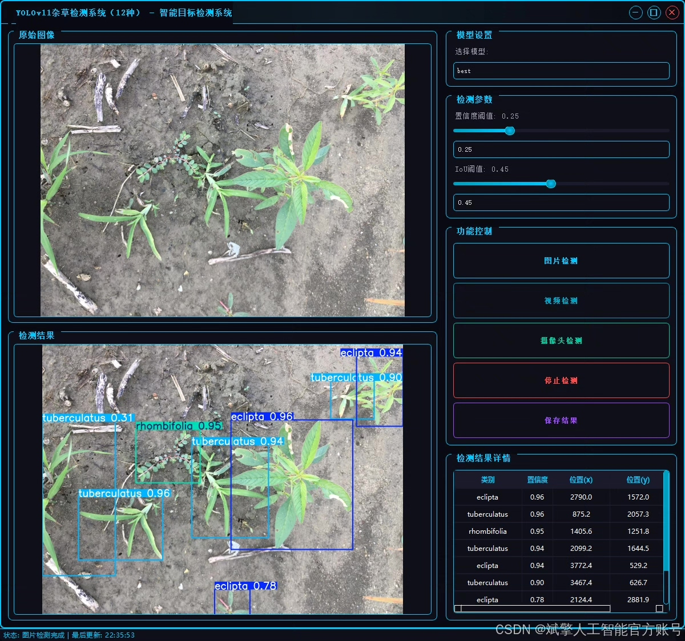
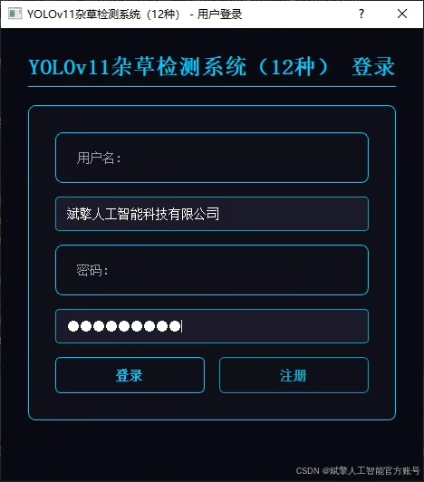
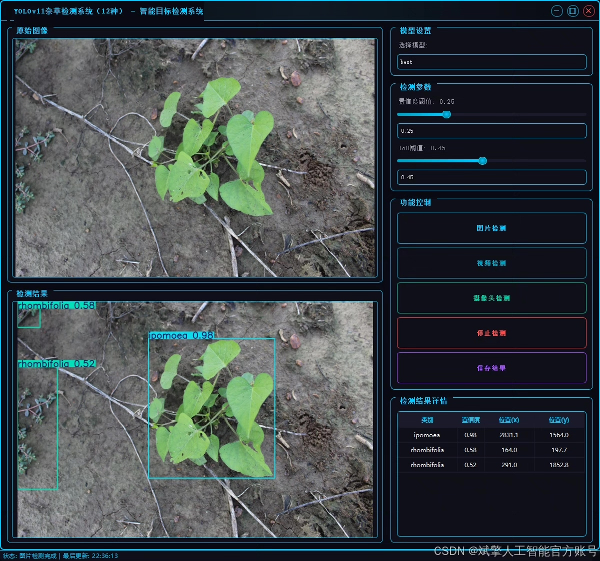
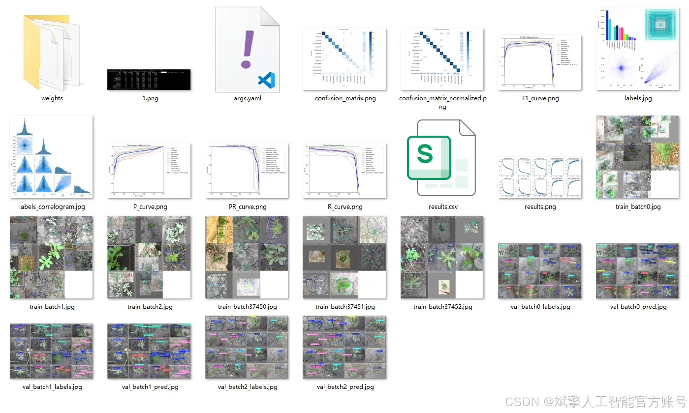
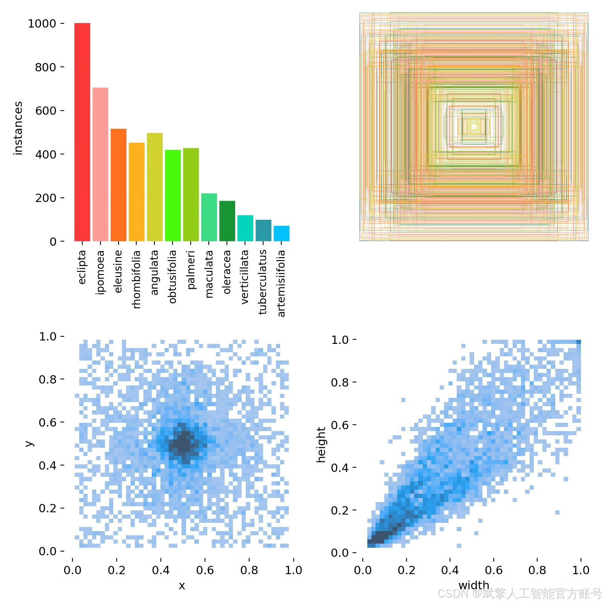
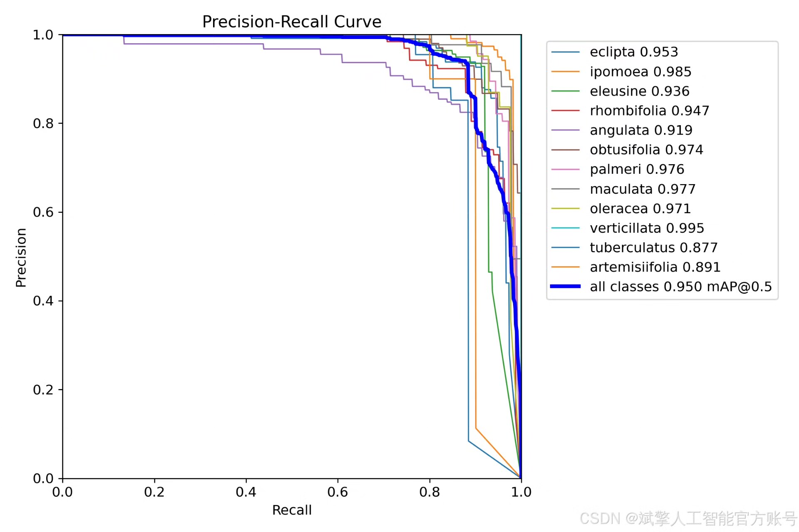
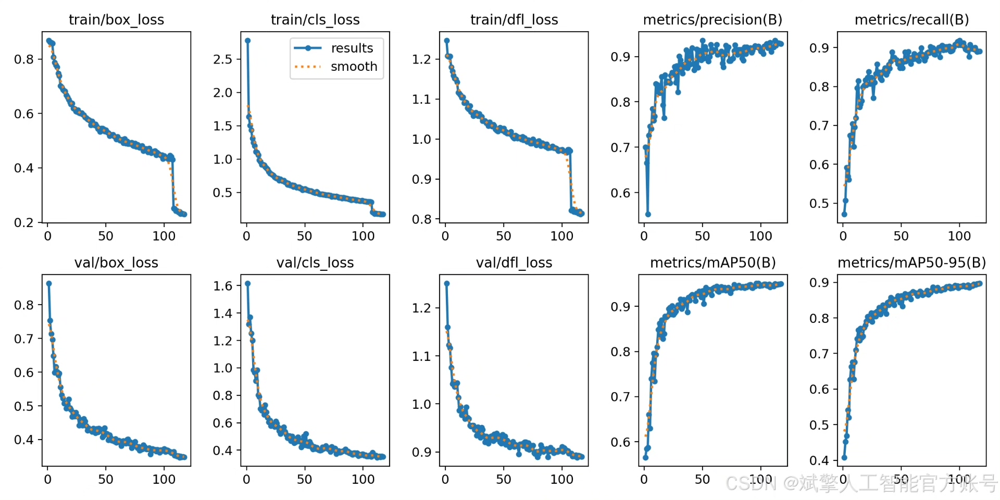
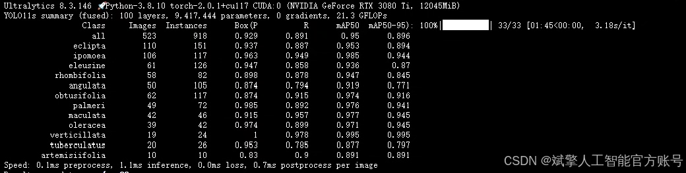
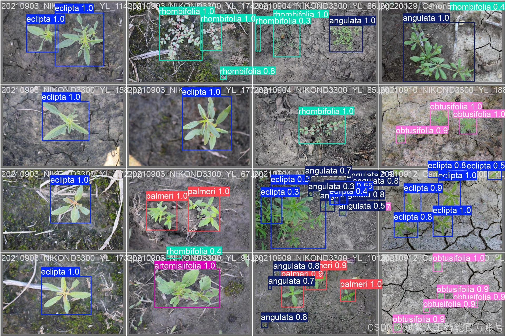

# YOLOv11 weed recognition system

## Body

YOLOv11 Weed Identification System Based on Deep Learning YOLOv11: A Weed Identification and Detection System (YOLOv11+YOLO dataset + UI interface + login registration interface + Python project source code + model)

This paper designs and implements an efficient weed identification and detection system based on the YOLOv11 deep learning framework, aiming to solve the practical problem of precise weed identification in the agricultural field. The system adopts an improved YOLOv11 algorithm, combined with a dataset containing 12 types of weeds (such as eclipta, ipoemaea, etc.), consisting of 2796 training images and 523 validation images. The system integrates a user-friendly UI interface, supporting login and registration functions. Experiments show that the model achieves relatively high accuracy (mAP@0.5 is 95%), significantly better than traditional methods. This study provides an automated solution for weed management in smart agriculture, with both the code and the model being open-sourced.

Dataset:
nc: 12
names: ['eclipta', 'ipomoea', 'eleusine', 'rhombifolia', 'angulata', 'obtusifolia', 'palmeri', 'maculata', 'oleracea', 'verticillata', 'tuberculatus', 'artemisiifolia'],
dataset quantity: 2796 training images, 523 validation images.

✅ User login registration: Supports password verification and security validation.
✅ Three detection modes: Based on the YOLOv11 model, supports image, video, and real-time camera detection, accurately identifying targets.
✅ Dual-screen comparison: Displays original images and detection results side by side.
✅ Data visualization: Real-time table displaying the category, confidence, and coordinates of detected targets.
✅ Intelligent parameter adjustment: Offers a confidence slide bar, dynamically optimizing detection accuracy to meet different scene needs.
✅ Sci-fi style interactive interface: Dark theme paired with dynamic light effects, reducing visual fatigue and improving operational experience.

## Images

## Payment

Here is a pay link on Stripe ( https://buy.stripe.com/3cs8yP7sY87d0vu9AB ). Please contact me lonlonago@foxmail.com after funding $89, and I will send you a complete data files , thank you!

